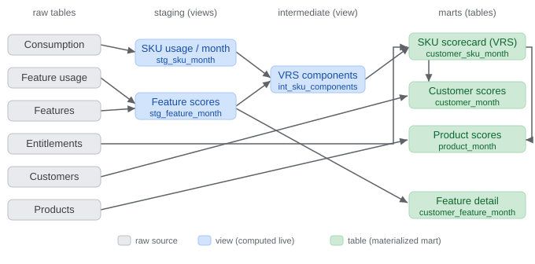

# Product & Technical Spec: Value Realization Score (VRS) Framework

**Author:** Principal PM, Product Analytics
**Audience:** CPO, GMs of Product, Customer-Facing Leadership
**Status:** Proposal for decision
**Domain:** Cybersecurity platform, recurring-revenue + consumption-based offerings (PANW-style)

---

## 1. Problem & Objective

Leadership is redesigning how we measure product adoption and customer value capture, and is debating how to evaluate success and **incentivize the right behaviors** for customer-facing teams.

A single naive metric — cumulative license utilization (`consumed ÷ licensed`) — misreads every important real-world situation: it over-rewards early-spike accounts and overage accounts, is blind to shelfware, and mis-scores expanding accounts. Optimizing customer teams against it would actively drive the wrong behavior (pushing vanity consumption, giving away product past the license, ignoring silent shelfware).

**Objective:** Define a North Star metric — the **Value Realization Score (VRS)** — that (a) reflects genuine value realization across the customer journey from deployment through post-implementation, (b) is measurable at both the **SKU level** and the **feature level within each SKU**, (c) survives messy enterprise data, and (d) drives the right customer-facing actions and incentives.

---

## 2. Key Definitions

- **Purchased** — the commercial transaction: a customer bought a SKU with `units_purchased` for a contract term.
- **Entitled** — the rights that purchase grants: a bundle of features + a `licensed_amount` (the entitlement quantity) + a date window. One purchase → one entitlement → **many** entitled features. The framework anchors on **entitlement**, because it defines the full surface area the customer *could* use, which is what adoption and shelfware are measured against.
- **`unit_of_measure`** — the entitlement unit for a SKU, which varies by form factor (see §3.1): credits, device-licenses, seats, or Mbps. `licensed_amount` is always expressed in this unit.
- **Consumed** — what the customer actually used, in the same `unit_of_measure`, per month.
- **Absolute normalization** — every component is mapped to 0–1 by a **fixed rule with fixed thresholds**, *not* by ranking customers against each other (i.e. **not** grading on a curve). A given raw value always yields the same score, in any month, for any customer — giving stability over time, cross-account/cross-month comparability, and real-world-anchored triggers. (Percentile/peer views may appear on the dashboard as a secondary lens, but the North Star stays absolute.)

---

## 3. The North Star: Value Realization Score (VRS)

A single **0–100** score computed per **customer × SKU × month**, rolled up to customer and product level. It is a weighted composite of four absolutely-normalized (0–1) components, each answering a different plain-language question:

> **Utilization = how deep · Feature Adoption = how broad · Sustained Usage = how durable · Time to Value = how fast they started.**

```
VRS = 100 × ( 0.35·Utilization
            + 0.25·FeatureAdoption
            + 0.25·SustainedUsage
            + 0.15·TimeToValue )
```

The composite (rather than one ratio) is the core design decision: an account can be strong on one axis and weak on another, and each axis routes to a different owner and play. **A weak axis can be averaged away by strong ones — see §4.5 Guardrail Flags, which carry the risks that weighting alone would bury.**

### 3.1 Universal LUR denominator (form-factor agnostic)

Utilization is `LUR = consumed ÷ licensed_amount`, where `licensed_amount` is **units/licenses purchased**, not the platform's raw throughput capacity. This keeps LUR pointed at *value realization* ("are you using what you paid for?") rather than *sizing* ("is the box big enough?"). One formula works across every form factor; only the unit changes:

| Form factor (`product_platform`) | `unit_of_measure` (`licensed_amount`) | Consumed (numerator) | LUR meaning |
|---|---|---|---|
| Hardware NGFW (PA-Series) | # device subscription licenses purchased | # activated & actively inspecting on live firewalls | are the licenses you bought deployed |
| Software NGFW (VM/CN-Series) | Software NGFW credits purchased | credits drawn down | are you using the pool you bought |
| SASE (Prisma Access) | user seats (or Mbps) licensed | active connecting users | are the seats you bought used |

Notes: on hardware, LUR trends toward a **discrete** fraction (a license is on-a-live-firewall or shelved), while credits/seats are **continuous**; the same utilization curve (§4.1) handles both. **Throughput/capacity utilization** (traffic vs. rated capacity) is retained as a *secondary operational signal* for sizing/right-provisioning — not part of VRS.

### 3.2 Weight rationale

Weights encode a priority ranking: **utilization > (breadth = durability) > speed**, and sum to 1.0 so VRS stays interpretable.

- **Utilization 0.35 (highest)** — most direct proxy for "getting the capacity they paid for," closest axis to renewal dollars.
- **Feature Adoption 0.25 / Sustained Usage 0.25 (tied)** — strong secondary signals of adoption *quality*; breadth guards against fragile single-feature accounts, durability guards against churn.
- **Time to Value 0.15 (lowest)** — a transient, early-lifecycle signal; discriminates only in the first ~90 days, then pins at 1.0. Enough weight to make onboarding matter, not enough to distort the mature-account picture.

All weights and thresholds are **tunable parameters** (may be revisited per segment/platform — see §11 open questions).

---

## 4. Component Definitions & Bands

Grain for every component: customer `c` × SKU/entitlement `e` × month `m`. Utilization, Feature Adoption, and Sustained Usage are all measured **monthly, in parallel**, once the account is live; only Time to Value is a one-time gate.

### 4.1 Utilization (weight 0.35) — depth axis

Raw input: `LUR = consumed / effective_licensed_amount`, where `effective_licensed_amount` = **sum of all concurrently-active licensed amounts** for that customer×product in month `m` (overlap-resolution step; handles mid-year expansions).

Piecewise curve `UH(LUR)` — linear interpolation `output_start + (LUR − input_start) × slope`:

| LUR range | Formula | Score | Category |
|---|---|---|---|
| < 0.10 | — | `0.0` | 🔴 Shelfware |
| 0.10 – 0.60 | `0.3 + (LUR − 0.10) × 1.2` | 0.3 → 0.9 | 🟠 Underutilized |
| 0.60 – 1.00 | `0.9 + (LUR − 0.60) × 0.25` | 0.9 → 1.0 | 🟢 Healthy |
| 1.00 – 1.20 | — | `1.0` | 🟢 Fully utilized (peak) |
| > 1.20 | — | `0.8` (cap) + Expansion flag | 🔵 Overage |

Slope derivation: underutilized band stretches input width 0.50 onto output width 0.6 → slope 1.2; healthy band stretches input width 0.40 onto output width 0.1 → slope 0.25. The two slopes differ **on purpose** — 10%→60% (near-shelfware to real use) should move the score a lot; 60%→100% is already "good" so it barely moves (diminishing returns). The curve steps down past 120% so full-and-fair utilization outranks both under- and over-use.

**Activation cliff (design choice):** the jump from `0.0` (below 0.10) to `0.3` (at 0.10) is a deliberate discontinuity — shelfware is a *categorical* state, and crossing from unused to activated is the single biggest adoption step, so it earns an immediate baseline. **Option A (default):** keep the cliff (crisp shelfware call, reinforced by the Shelfware flag). **Option B:** smooth it (ramp 0.0→0.9 across 0.10–0.60, slope 1.8) if a reviewer objects to discontinuities — at the cost of blurring "just activated" into "near shelfware."

### 4.2 Feature Adoption (weight 0.25) — breadth + depth axis

Feature usage is **not boolean** — CDSS-style features (Advanced Threat Prevention, Advanced WildFire, Advanced URL Filtering, Advanced DNS Security, IoT/OT Security, GlobalProtect, Enterprise DLP, …) are measurably active, so each entitled feature `f` gets a graded level score:

| Feature state | Condition | `feature_score` |
|---|---|---|
| Not enabled | no config / zero events | `0.0` |
| Enabled but idle | events < meaningful floor | `0.3` |
| Actively used | floor ≤ events < deep threshold | `0.7` |
| Deeply used | events ≥ deep threshold | `1.0` |

`FeatureAdoption(SKU) = mean(feature_score over all entitled features)`. This axis **never looks at license quantity** — it measures which capabilities are live and how deeply. "Enabled but idle" surfaces feature shelfware even inside otherwise-healthy SKUs.

| FA range | Category |
|---|---|
| < 0.25 | 🔴 Narrow / mostly idle |
| 0.25 – 0.50 | 🟠 Partial |
| 0.50 – 0.75 | 🟢 Broad |
| > 0.75 | 🟢 Broad + deep |

**Graceful degradation for feature-less SKUs:** some SKUs are a single product with one meter and no separately-adoptable features (purchased ≈ entitled). For these, **drop the Feature Adoption component and re-normalize the remaining weights** (0.35 / 0.25 / 0.15 rescaled to sum to 1) so VRS reflects only the axes that carry information. The dashboard omits the Feature Adoption bar for such SKUs. *(Implemented in the pipeline: such SKUs get a null `feature_adoption` and a renormalized VRS; in the current synthetic catalog every product carries 3–6 features, so the rule is exercised only if the catalog changes.)*

### 4.3 Sustained Usage (weight 0.25) — durability axis

Trailing 3-month window (`m`, `m-1`, `m-2`). `active[month] = 1 if consumption ≥ meaningful floor` (deliberately **binary** — coarser than Utilization: Utilization measures *depth in one month*, Sustained Usage measures *presence across months*). Recency-weighted:

```
SUS = (0.5·active[m] + 0.3·active[m-1] + 0.2·active[m-2]) / (0.5 + 0.3 + 0.2)
```

Window = 3 months because a quarter matches QBR cadence and balances responsiveness vs. noise: 12 months would dilute a recent collapse into invisibility (defeating spike-and-drop detection); 1 month is too noisy. Tunable.

| Pattern | SUS | Category |
|---|---|---|
| All 3 active | 1.0 | 🟢 Durable |
| Recent active, older gaps | 0.5–0.8 | 🟢 |
| Only oldest month active (spike then drop) | 0.2 | 🔴 Churn signal |
| None active | 0.0 | 🔴 Dormant |

### 4.4 Time to Value (weight 0.15) — speed axis

`ttv_days = date(first meaningful consumption OR first feature adoption) − entitlement.Start_Date`

| ttv_days | Formula | Score | Category |
|---|---|---|---|
| ≤ 30 | — | `1.0` | 🟢 Fast |
| 31 – 90 | `1 − (ttv_days − 30) / 60` | 1.0 → 0.0 | 🟠 Slow |
| > 90 or never | — | `0.0` | 🔴 Onboarding stall |
| account age < 30d, no value yet | — | *neutral / excluded* | ⚪ Grace period |

Formula reading: `(ttv_days − 30)` = days past the "fast" cutoff; `÷ 60` normalizes by window width (90−30); `1 −` flips it so more delay = lower score. Day 30 → 1.0, day 60 → 0.5, day 90 → 0.0. The grace-period rule stops a brand-new account being punished or mistaken for shelfware.

**Grace-period implementation (monthly grain):** a SKU-month is in grace when it is the SKU's **first calendar month** and no meaningful use has occurred yet. For such rows the pipeline (a) drops the TTV term and renormalizes the remaining weights (0.35 / 0.25 / 0.25 rescaled to sum to 1), emitting a null `ttv_score`, and (b) resolves the state to **Grace Period** instead of Shelfware Risk (see §6). From the second month on, an unactivated SKU is judged normally.

### 4.5 States vs. Guardrail Flags

Two distinct concepts, deliberately kept separate:

- **State** (§6) — one **mutually-exclusive** label per SKU-month describing the account's situation and primary play (Value Realized, Shelfware Risk, Lapsed, Churn Signal, etc.). Every row gets exactly one.
- **Guardrail flags** — independent booleans that fire **orthogonally to the state**, catching a risk or opportunity hiding inside an *otherwise-healthy* account — i.e. what the VRS average and the state both mask. A flag earns its place only if it can be true on an account whose state looks fine.

By that test there are exactly **two** flags. (Shelfware, churn, and onboarding are *not* flags — they are already resolved states, so a boolean restating them would be redundant.)

| Flag | Rule | Why it's orthogonal | Routed to |
|---|---|---|---|
| **Single-feature dependency** | `FA < 0.25` while **raw LUR ≥ 0.9** | fires on a "Value Realized" SKU that's secretly fragile | CS: broaden adoption |
| **Expansion opportunity** | `LUR > 1.20` | an over-consuming SKU is healthy *and* an upsell at once | Sales: upsell |

Final readout = **state + VRS + any flags**. (Motivating case: a SKU at 96% utilization with only 1 of 8 features live scores VRS ≈ 78 and state "Value Realized" — the single-feature flag is the only thing that catches the fragility.)

**Why the gate is raw LUR, not the scored Utilization:** the overage cap fixes `util_health` at 0.8 for LUR > 1.2, so gating on the *score* would exempt heavy over-consumers with narrow adoption — exactly who this flag exists to catch. Gating on raw LUR ≥ 0.9 also keeps the flag out of the 60–90% LUR range (where `util_health` already reads ≥ 0.9), so it fires only on genuinely heavy usage. An overage SKU with narrow adoption carries **both** flags: expansion *and* single-feature dependency.

---

## 5. Thresholds & Reference Tables

Two distinct "meaningful floors," because two different things are measured:

**Utilization floor** (for the shelfware cutoff, Sustained Usage `active` test, and TTV "first meaningful consumption") — relative to entitlement so it auto-scales per account:

```
utilization_floor = 0.10 × effective_licensed_amount
```

**Feature floor + deep threshold** (for the 0/0.3/0.7/1.0 feature scoring) — per-feature **absolute benchmarks**, because features have wildly different natural volumes (DNS Security resolves millions of queries; IoT Security sees far fewer). These are stored as **columns on the `features` table** — `meaningful_floor_events` and `deep_threshold_events`:

```
meaningful_floor_events = 0.20 × expected_active_volume   -- below this: "enabled but idle"
deep_threshold_events   = 0.80 × expected_active_volume   -- at/above this: "deeply used"
```

`expected_active_volume` is the feature's **typical monthly active event count** — a per-feature scale parameter reflecting how much usage a healthy deployment generates (e.g. Advanced DNS Security ≈ millions of resolved queries/month; IoT/OT Security ≈ tens of thousands of events/month). The 20%/80% split makes the floor "meaningfully switched on" and the deep bar "carrying real load." Storing the thresholds on the feature row (rather than a separate table) keeps each feature judged against its own fixed yardstick, preserving absolute normalization, and lets the pipeline and tests read the cutoffs by a simple join to `features`.

**Parameter register (defaults):** weights 0.35/0.25/0.25/0.15; shelfware cutoff 0.10; healthy band 0.60–1.00; overage threshold 1.20, cap 0.80; TTV bounds 30/90 days; Sustained Usage window 3 months, recency weights 0.5/0.3/0.2; VRS bands 70/50/30.

---

## 6. Composite Bands & State Machine

| VRS | State (default) | Color |
|---|---|---|
| ≥ 70 | Value Realized | 🟢 |
| 50 – 69 | Developing / Watch | 🟡 |
| 30 – 49 | At Risk | 🟠 |
| < 30 | Critical | 🔴 |

The state is one **mutually-exclusive** label per SKU-month. Because a SKU can satisfy several conditions at once (e.g. a collapsed account has `util_health = 0` *and* a high `prior_lur` *and* was active before), the state is resolved by a **priority ladder — most specific/urgent first, generic VRS bands last** (first match wins):

| Priority | State | Trigger | Owner / Play |
|---|---|---|---|
| 0 | **Grace Period** | first calendar month of the SKU, no meaningful use yet (§4.4) | none — too new to judge |
| 1 | **Churn Signal** | `prior_lur ≥ 0.6 AND sustained_usage < 0.34` (just collapsed) | CS: save play (urgent) |
| 2 | **Lapsed** | `util_health = 0 AND ever_active_before = 1` (was active, now dead) | CS: win-back |
| 3 | **Shelfware Risk** | `util_health = 0 AND ever_active_before = 0` (never activated) | CS: activation play |
| 4 | **Onboarding Stall** | `ttv_score < 0.5 AND FA < 0.3` (slow + shallow deploy) | Deployment: implementation help |
| 5–8 | **Value Realized / Developing / At Risk / Critical** | VRS ≥ 70 / 50 / 30 / else | prioritize by score |

Why the order: churn must precede shelfware (a collapsed SKU also has `util_health = 0`, so checking shelfware first would mislabel every churn as shelfware); Lapsed precedes Shelfware (both have `util_health = 0`; "ever active before" is the distinguishing, more-specific fact); specific states precede the generic VRS bands. `ever_active_before` is a **lifetime** memory (not the 3-month `prior_lur`), so a churned SKU stays "Lapsed" instead of decaying back into "Shelfware Risk" once the collapse ages out of the recent window.

**Incentive design:** measure customer-facing teams on **% of accounts in "Value Realized"** and **net positive state transitions** — *not* raw consumption. A single signal can produce two outputs: an overage SKU stays healthy on adoption (state Value Realized, utilization capped at 0.8 so CS isn't falsely credited) *and* raises a Sales **expansion flag** (so revenue is captured).

---

## 7. Grain: SKU Level and Feature Level

- **SKU level (per customer × entitlement × month):** VRS, LUR, Utilization, Feature Adoption, Sustained Usage, TTV, resolved state, flags.
- **Feature level (per customer × feature × month):** adoption level score, first-adopted date, usage intensity, and **entitled-but-never-adopted** ("feature shelfware"). SKU-level Feature Adoption aggregates these.

### 7.1 ARR-weighted roll-up

VRS is computed at the customer × SKU × month grain, then rolled up **weighted by ARR** (not a simple average), so the score moves with dollars at risk rather than SKU count:

```
Customer VRS(m) = Σ_sku ( VRS_sku × ARR_sku ) / Σ_sku ARR_sku
Product  VRS(m) = Σ_cust( VRS_cust_for_product × ARR ) / Σ ARR
```

Rationale: a plain average gives a $50K add-on the same vote as a $900K core deal, which can make a customer look healthy while most of their revenue is failing. ARR-weighting makes a red customer genuinely mean "significant revenue in trouble." Applied again at the product level so a few large accounts aren't drowned out by many small ones. The dashboard exposes both VRS and **ARR-at-risk** (ARR of SKUs in the "At Risk" band or worse, i.e. VRS < 50 — aligned to the state bands in §6, not merely "below Value Realized").

---

## 8. PANW Product Mapping

PANW's Strata network-security platform delivers one NGFW engine (PAN-OS) across form factors, with a shared CDSS layer and one management plane (Strata Cloud Manager). Because it already runs a consumption/credit model with a modular feature layer, VRS measures the business model PANW already sells.

| Product | Entitlement | VRS reads as |
|---|---|---|
| **VM/CN-Series** (Software NGFW Credits) | credit pool + fundable CDSS | LUR = credits used ÷ purchased; Feature Adoption = which CDSS enabled & inspecting; overage = credit burn > pool |
| **PA-Series hardware** | appliance + per-device CDSS subscriptions | LUR = activated licenses ÷ purchased; TTV = ship → first traffic; Feature Adoption = CDSS live vs. dark |
| **Prisma Access (SASE)** | licensed users / Mbps | LUR = active users ÷ licensed; Feature Adoption = ZTNA/SWG/CASB/DLP modules; Sustained Usage = monthly active users |

CDSS (Advanced Threat Prevention, Advanced WildFire, Advanced URL Filtering, Advanced DNS Security, IoT/OT Security, GlobalProtect, Enterprise DLP, SaaS Security, AI Access Security) attach to **all** form factors — funded per-device on hardware, from the credit pool on software.

Edge cases in PANW terms: **Spike & Drop** = bulk branch onboarding / log backlog ingest in Q1 then flatline; **Shelfware** = bought Advanced DNS Security or IoT Security, never enabled; **Overage** = drawing 120%+ of the credit pool / exceeding SASE bandwidth; **Mid-Year Expansion** = second larger credit pool or seat block mid-term → overlapping entitlements.

---

## 9. Edge-Case Handling (design requirement)

| Anomaly | Real-world meaning | How a naive metric fails | How VRS responds |
|---|---|---|---|
| **Spike & Drop (~5%)** | Big one-time burn then flatline | Cumulative utilization shows a "star"; actually churning | Sustained Usage collapses → **Churn Signal** state during the drop, then **Lapsed** (not shelfware) |
| **Shelfware (~10%)** | Bought, never turned on | Invisible in consumption-only dashboards | Detected via **absence** vs. entitlement; Utilization = 0, never active → **Shelfware Risk** state |
| **Consistent Overage (~15%)** | Uses 120%+ of license | Linear reward ranks overage "healthiest"; naive cap hides upsell | Utilization capped at 0.8 (stays Value Realized) + **Expansion** flag to Sales |
| **Mid-Year Expansion** | Overlapping entitlements | Double-counts license (false shelfware) or ignores a contract | Resolve timeline first: sum **concurrently-active** licensed amounts per overlap window, then divide |

---

## 10. Data Model & Outputs

**Inputs:** Customers (~100), Products (~500, with `product_platform`, `unit_of_measure`), Entitlements (~500, `licensed_amount`, `units_purchased`, `unit_price`, `arr`, `start_date`, `end_date`, `is_expansion`), Features (~2,000, with `meaningful_floor_events`, `deep_threshold_events`), Consumption (12+ months), Feature Adoption (12+ months). `arr` (= annualized `units_purchased × unit_price`) drives the §7.1 roll-up and dollars-at-risk views. Anomalies injected at the rates in §9.

**Outputs (pipeline targets):** `mart_customer_sku_month` (VRS + components + state + flags), `mart_customer_feature_month`, `mart_customer_month`, `mart_product_month`. Consumed by the dashboard and data-quality tests.

**Pipeline architecture:** the dbt-style model lineage — six raw tables → two staging views → one intermediate view → four marts — is shown in `docs/vrs_pipeline_dataflow.svg` (gray = raw source, blue = view, green = materialized mart). This diagram is also used in the executive presentation.



---

## 11. Open Decisions for Leadership

1. Confirm overage cap (0.80 default) vs. a harsher 0.60 if capacity risk is the bigger concern.
2. Confirm the "Value Realized" threshold (VRS ≥ 70) and the four bands.
3. Confirm component weights (0.35 / 0.25 / 0.25 / 0.15) — and whether they should vary by segment or product platform.
4. Confirm the incentive tie: teams measured on Value-Realized % and net state transitions.
5. Activation cliff: keep (Option A) or smooth (Option B)?
6. Validation: backtest VRS against historical renewal/NRR before rollout (see pressure-test log).
